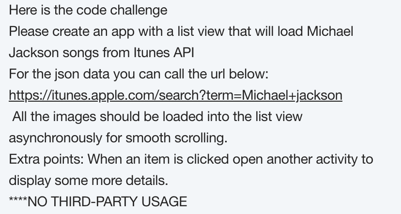
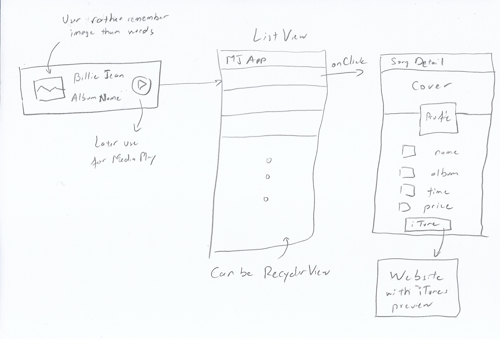
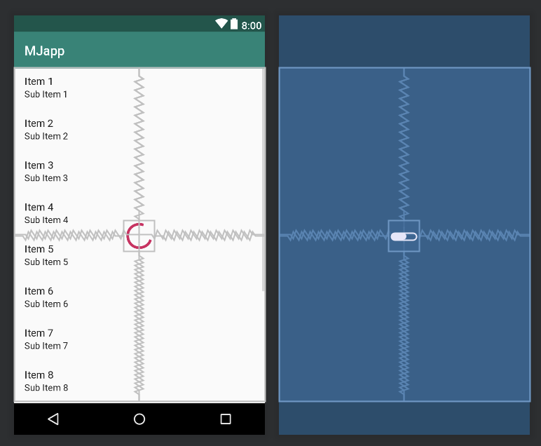
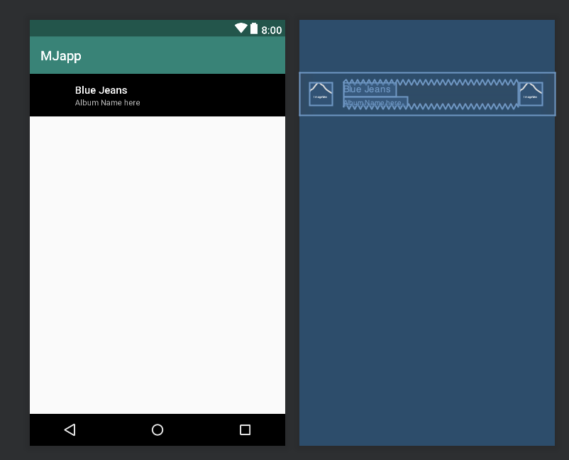
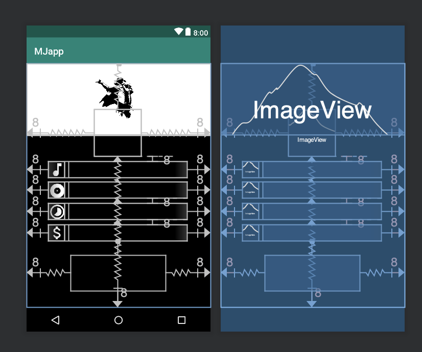

# MJapp Coding Challenge

This is an Android that get the Michael Jacson songs from iTunes database then populate it on the app.  
## The Challenge 
  

## User Stories

The following **required** functionality & technology is completely implemented:

- [x] ListView
- [x] AsyncTask for each Image work asynchronously
- [x] Loader
- [x] Network
- [x] JSON processing
- [x] Constraint Layout

The following **bonus** features are implemented:

- [x] Detail of songs
- [x] Intent by links to preview on iTunes

The following technology and technique can be implemented but not required:

- Recycler View
- Preview Music Audio
- Landscape and other dimensions
- Parcelable Object Model
- SavedInstance

Edge cases has been tested:
- [x] No Connectivity

## Mock Up and Blueprint
  
  
  
  

## Video Walkthrough

Here's a walkthrough of implemented user stories:

